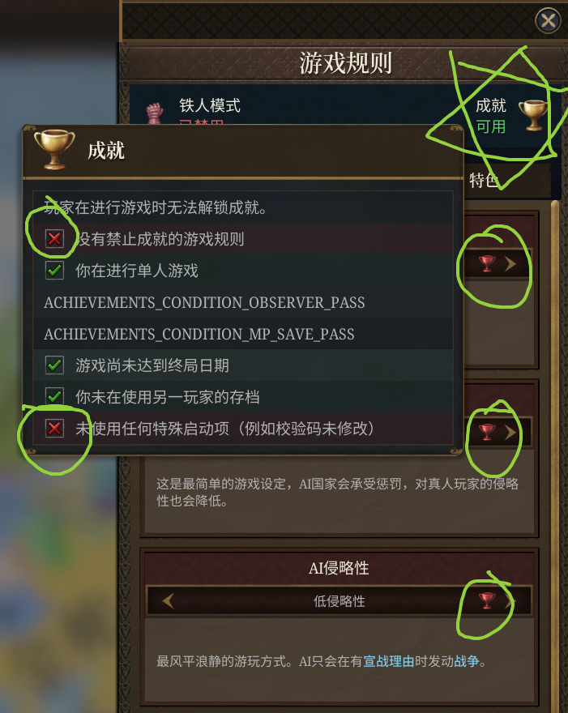

<div align="center">

# 🏆 EU5 Patcher

### Enable Achievements Unconditionally

[中文](README_CN.md) | [English](README.md)

[](LICENSE)
[]()
[]()

</div>

---

## 📖 About

The debate over whether **unmodified ironman mode** should be required to unlock achievements has been going on for years. While games like *Crusader Kings III* and *Stellaris* have adopted a more player-friendly approach, *Europa Universalis V* has unfortunately taken a step back.

This patcher allows you to:
- Enable **all achievements** in non-ironman mode.
- Enable **all game rules** in non-ironman mode.

| Mode        | Mod   | Setting | Console | Save & Load | Achievements |
| ----------- | ----- | ------- | ------- | ----------- | ------------ |
| Non-Ironman | ✅ Any | ✅ Any   | ✅ Yes   | ✅ Yes       | ✅ Yes        |


<div align="center">

</div>

---
## 🚀 How to Use
> [!TIP]
> You will need to patch `eu5.exe` again after every game update.

### 🐍 Option 1: Python Script

You can run the script from any location.

```bash
python patch.py
```

### ⚙️ Option 2: Compile from Source (C++)

```bash
# 1. Compile the source code
cl /std:c++17 /O2 /EHsc patch.cpp

# 2. Run the generated patch.exe
patch.exe
```

### ⚠️ Option 3: Pre-built Executable

> [!WARNING]
> Running unknown executables carries risks. Only proceed if you trust the source.

1. Download `patch.exe` from the [📦 Releases page](https://github.com/UFOdestiny/EU5-Patcher/releases/).
2. Run `patch.exe`.

---

## ✅ Post-Patching

If successful, you will see the message:
```
Path: "E:\\\\SteamLibrary\\steamapps\\common\\Europa Universalis V\\binaries\\eu5.exe"
Backup created: "E:\\\\SteamLibrary\\steamapps\\common\\Europa Universalis V\\binaries\\eu5.exe.backup"

Patch #1 (CanGetAchievements Branch-1) found at offset: 0x729bb0 (RVA 0x72a7b0)

Patch #3 (checksum via Branch-2) found at offset: 0x1f6ae70 (RVA 0x1f6ba70)

Patch #2 (CanGetAchievements Branch-2) found at offset: 0x3fa7480 (RVA 0x3fa8080)

Patch #4 (IsGameRuleEnabled via string xref) found at offset: 0x786810 (RVA 0x787410)

EU5 is successfully patched.
Press Enter to exit...
```

---

## 📚 How it works？

```
"CanGetAchievements"
        │
        └─ RIP-relative XREF
            │
            ├─ Registration #1
            │   └─ Callback
            │       └─ Predicate
            │           └─ Patch #1 → return true
            │
            └─ Registration #2
                └─ Callback
                    └─ Predicate
                        │
                        ├─ Identified as Branch-2
                        │
                        ├─ Patch #2 → return true
                        │
                        └─ call/jmp
                            └─ checksum()
                                └─ Patch #3 → return true


"IsGameRuleEnabled"
        │
        └─ RIP-relative XREF
            └─ Registration
                └─ Callback
                    └─ Predicate
                        └─ Patch #4 → return true


Patch result:
    B8 01 00 00 00 C3
    mov eax, 1
    ret
```

---

## 🙌 Credits

This project was created for educational purposes. Inspired by:
- [Enabling Achievements in Stellaris With Mods (All game versions) [SRE]](https://steamcommunity.com/sharedfiles/filedetails/?id=2460079052)